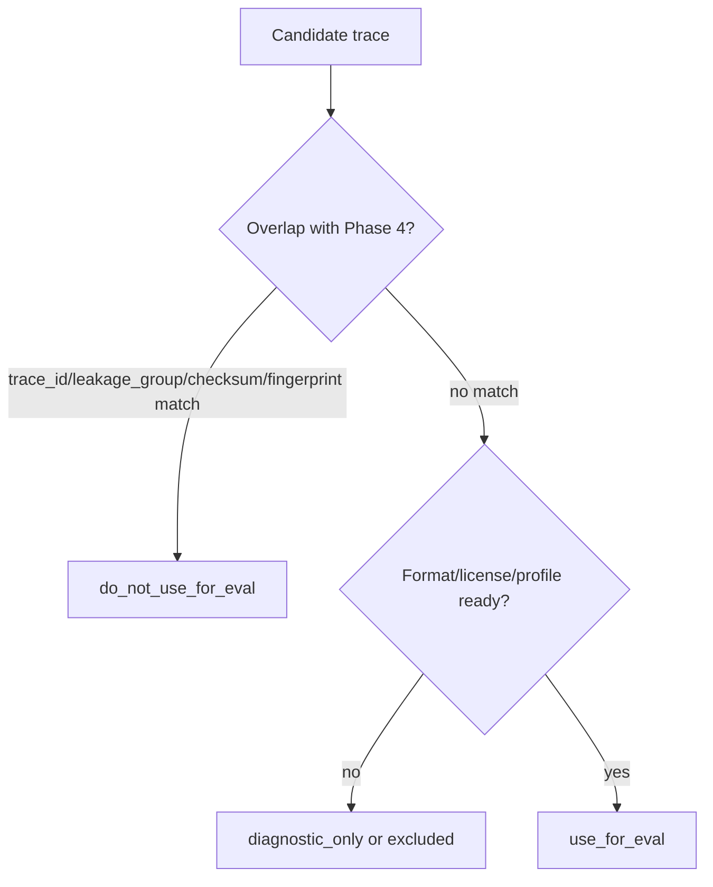

# Phase 6 Results Tables And Figures Plan

Status: final Phase 6A2 protocol decision extended by Phase 6D media-profile input planning. This is a plan only; no plots or tables from real data are generated here.

## Required Tables

| Table | Purpose | Inputs |
| --- | --- | --- |
| Controller matrix | Show controllers, classes and roles | `controller_matrix.md` and resolved config |
| Trace manifest summary | Show dataset families, splits, counts and eligibility | `phase6_trace_manifest_final.json` and audit report |
| Media profile summary | Show MPD duration, segment duration/count, ladder and size-source policy | `media_profile_phase6_v1.json` and Phase 6D reports |
| Primary result table | Report `qoe_linear_mean` descriptive statistics and CI95 | Future QoE summaries |
| Per-dataset result table | Show results by dataset family/evaluation group | Future QoE summaries |
| Pairwise comparison vs `robust_mpc` and `neural_abr_lite` | Compare paired differences against key comparators | Future paired statistics |
| Neural safety/fallback table | Summarize fallback use and safety reasons | Future neural telemetry summary |
| Gates/exclusions table | Explain excluded/diagnostic sessions and rows | Future exclusions/gates report |
| Reproducibility/evidence manifest table | Link commands, commit, environment and artifacts | Future evidence package manifest |

## Required Figures

- Phase 6 pipeline diagram.
- Trace eligibility/gating flow.
- `qoe_linear_mean` boxplot per controller.
- `qoe_linear_mean` mean + CI95 per controller.
- Per-dataset QoE comparison.
- QoE component decomposition.
- Total rebuffer per controller.
- Average bitrate per controller.
- Switch count/magnitude per controller.
- Selected trace bitrate timeline.
- Selected trace buffer timeline.
- Same-family vs OOD comparison.
- Gates/exclusions summary.
- Neural fallback/safety summary.

## Pipeline Diagram Draft

```mermaid
flowchart LR
    A["Source cards and dataset cards"] --> B["Candidate trace materialization outside Git"]
    B --> C["Eligibility audit"]
    C --> D["phase6_trace_manifest_final.json"]
    D --> E["media_profile_phase6_v1.json"]
    E --> F["Python trace-driven execution"]
    F --> G["QoE and component summaries"]
    G --> H["Statistical comparison over sessions/traces"]
    H --> I["Evidence package and thesis tables"]
```

## Gating Flow Draft

## Non-Authorization

Figures and tables listed here are planned outputs for future evidence work. They are not generated in Phase 6A2, Phase 6C or Phase 6D.
